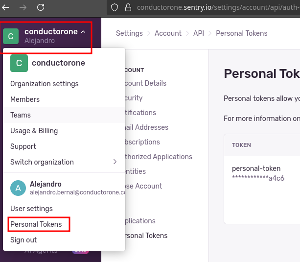

While developing the connector, please fill out this form. This information is needed to write docs and to help other users set up the connector.

## Connector capabilities

1. What resources does the connector sync?
- Organizations
- Teams
- Projects
- Users

2. Can the connector provision any resources? If so, which ones? 
- Users (create account / invite to organization, delete from organization)
- Organization Roles (grant/revoke org-level roles: billing, member, admin, manager, owner)
- Teams (grant/revoke team membership)
- Projects (grant/revoke team assignment to projects)

## Optional configuration

- **Organization IDs** (`--org-ids` / `BATON_ORG_IDS`): A comma-separated list of Sentry organization IDs or slugs to sync. When set, only the specified organizations (and their users, teams, and projects) are synced. Leave unset to sync all organizations. This is useful when a Sentry account belongs to multiple organizations and you want to avoid duplicate user records caused by users having different internal IDs per org.

## Connector credentials 

1. What credentials or information are needed to set up the connector? (For example, API key, client ID and secret, domain, etc.)
API Token

2. For each item in the list above: 

   * How does a user create or look up that credential or info? Please include links to (non-gated) documentation, screenshots (of the UI or of gated docs), or a video of the process. 
   create it in the sentry dashboard, like in the image: 
   
   
   * Does the credential need any specific scopes or permissions? If so, list them here. 
   admin

   * If applicable: Is the list of scopes or permissions different to sync (read) versus provision (read-write)? If so, list the difference here. 

   * What level of access or permissions does the user need in order to create the credentials? (For example, must be a super administrator, must have access to the admin console, etc.)  
   admin
